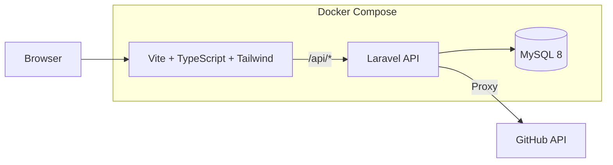

  <strong>GitHub 専用タスク管理アプリ</strong> 
  Issue / Pull Request を「やること」として再定義する

  

  
  
  
  
  
  

##  概要

**Allocate** は、  GitHub 上の **Issue・Pull Request** をタスクとして一元管理できる  
**GitHub 特化型タスク管理アプリ**です。

GitHub から離れた瞬間に形骸化しがちなタスク管理を、  **開発フローの中心に引き戻す** ことを目的にしています。

## コンセプト

> GitHub を、タスク管理ツールとして使い切る

- Issue = やること  
- Pull Request = 進捗  
- GitHub = 開発のハブ  

## アーキテクチャ

 

### 開発クイックガイド

開発ガイド

  
■ スタック
- Frontend: Vite + TypeScript + Tailwind（プレーンTS）
- Backend: Laravel + Nginx（API 専用）
- DB: MySQL 8（Docker Compose）

■ はじめかた（初回）
- 起動: `docker compose up -d --build`
- フロント: http://localhost:5173
- API: http://localhost:8080 / ヘルス: http://localhost:8080/api/health
- DB 接続: host `db` / user `app` / pass `app` / db `app`

■ 開発開始（毎回）
- 起動: `docker compose up -d`
- 動作確認: `curl http://localhost:8080/api/health` が JSON を返す / `http://localhost:5173` が表示される
- 必要ならログ: `docker compose logs -f php`（`nginx` / `frontend` も同様）

■ 開発中（最低限）
- API を編集: `backend/app/routes/api.php`
- 画面を編集: `frontend/src/main.ts`（`fetch('/api/...')`）
- マイグレーション: `docker compose exec php php artisan migrate`
- 依存追加（BE）: `docker compose exec php composer require vendor/package`
- 型/ビルド（FE）: `docker compose exec frontend npm run typecheck` / `npm run build`

■ 開発終了（毎回）
- 停止: `docker compose down`（DB は残す）
- まっさらにする: `docker compose down -v`（DB も削除）

■ ルール
- Laravel は API サーバのみ（ルートは `routes/api.php`）。
- フロントからは常に `/api` にアクセス。
- `.env` は初回に自動設定（必要なら `backend/app/.env` を編集）。

■ branch命名ルール
- タグ名/変更範囲/説明
例 feature/front-main/add-login-function

</detail>
