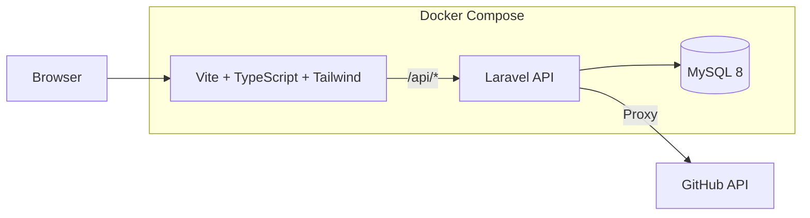

  <strong>GitHub 専用タスク管理アプリ</strong> 
  Issue / Pull Request を「やること」として再定義する

  

  
  
  
  
  
  

 

##  概要

**Allocate** は、  GitHub 上の **Issue・Pull Request** をタスクとして一元管理できる  
**GitHub 特化型タスク管理アプリ**です。

GitHub から離れた瞬間に形骸化しがちなタスク管理を、  **開発フローの中心に引き戻す** ことを目的にしています。

 

## コンセプト

> GitHub を、タスク管理ツールとして使い切る

- Issue = やること  
- Pull Request = 進捗  
- GitHub = 開発のハブ

 

## アーキテクチャ

 

## メンバー

<table>
  <tr>
    <td align="center" width="160">
      <a href="https://github.com/Sh1ragami">
        
         
        <b>Sh1ragami</b>
      </a>
       
    </td>
    <td align="center" width="160">
      <a href="https://github.com/ruihigashi">
        
         
        <b>ruihigashi</b>
      </a>
       
    </td>
    <td align="center" width="160">
      <a href="https://github.com/miyuseki">
        
         
        <b>miyuseki</b>
      </a>
       
    </td>
    <td align="center" width="160">
      <a href="https://github.com/manamisan0321">
        
         
        <b>manamisan0321</b>
      </a>
       
    </td>
     <td align="center" width="160">
      <a href="https://github.com/uchinomanami">
        
         
        <b>uchinomanami</b>
      </a>
       
    </td>
    <td align="center" width="160">
      <a href="https://github.com/ishihara0212">
        
         
        <b>ishihara0212</b>
      </a>
       
    </td>
    <td align="center" width="160">
      <a href="https://github.com/ochimasato0186">
        
         
        <b>ochimasato0186</b>
      </a>
       
    </td>
  </tr>
</table>

 

## License

MIT License © 2021 [Anthony Fu](https://github.com/antfu)
