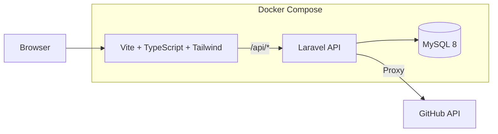

  <strong>GitHub 専用タスク管理アプリ</strong> 
  Issue / Pull Request を「やること」として再定義する

  

  
  
  
  
  
  

 

## 概要

本プロジェクトは、ソフトウェア開発におけるタスク分割・担当者割り当て・進捗管理を自動化し、プロジェクト管理の効率化とチーム全体の生産性向上を実現するシステムです。

従来、開発初期のタスク設計や担当者のアサインは人手に依存することが多く、

* メンバーの スキル
* 稼働状況
* 希望分野
* 現在の負荷

といった要素を総合的に考慮した最適な割り当てを行うことは困難でした。
また、これらの調整や進捗把握はリーダーに大きな負担を与え、結果として開発スピードの低下や管理コストの増大につながるという課題がありました。

本システムでは、GitHubと連携し、タスク生成・割り当て・進捗管理を自動化することで、リーダーの負担を軽減し迅速な開発サイクルを実現します。

 

## 主な機能

1. タスク登録・自動生成
* ユーザーが実装したい機能、想定人数、タスク内容を入力
* gh コマンドを用いてタスクを GitHub Issue / PR として自動生成
* Issue / PR の作成・更新イベントを GitHub Actions 経由でサーバーに連携し、アサインや進捗管理に反映

2. 自動割り当て機能
* サーバー側で以下の要素を考慮し、スコアリングを実施
* スキルセット
* 希望分野
* 稼働時間帯 etc.

3. ダッシュボード
* Web UI 上で状況を可視化
* 必要に応じて 手動で担当者やタスク内容の編集も可能

 

## アーキテクチャ

 

## メンバー

<table>
  <tr>
    <td align="center" width="160">
      <a href="https://github.com/Sh1ragami">
        
         
        <b>Sh1ragami</b>
      </a>
       
    </td>
    <td align="center" width="160">
      <a href="https://github.com/ruihigashi">
        
         
        <b>ruihigashi</b>
      </a>
       
    </td>
    <td align="center" width="160">
      <a href="https://github.com/miyuseki">
        
         
        <b>miyuseki</b>
      </a>
       
    </td>
     <td align="center" width="160">
      <a href="https://github.com/uchinomanami">
        
         
        <b>uchinomanami</b>
      </a>
       
    </td>
    <td align="center" width="160">
      <a href="https://github.com/ishihara0212">
        
         
        <b>ishihara0212</b>
      </a>
       
    </td>
    <td align="center" width="160">
      <a href="https://github.com/ochimasato0186">
        
         
        <b>ochimasato0186</b>
      </a>
       
    </td>
  </tr>
</table>

 

## License

MIT License © 2025 [Sh1ragami](https://github.com/Sh1ragami)
